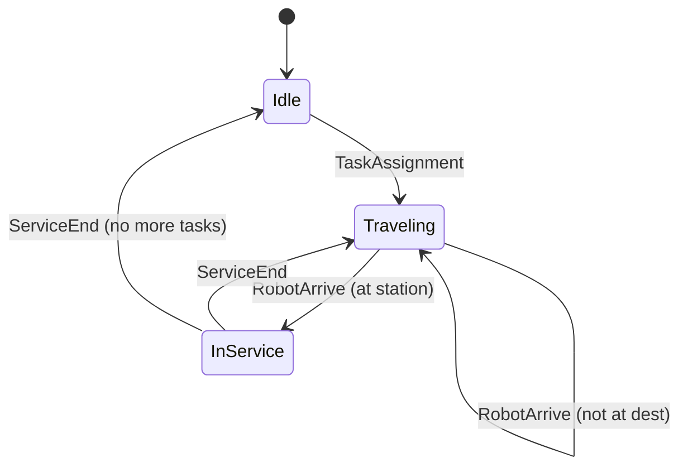
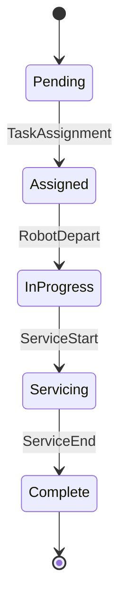

# Discrete Event Simulation

Fundamentals of discrete event simulation in Waremax.

---

## What is DES?

**Discrete Event Simulation (DES)** is a modeling methodology where:

- System state changes at discrete points in time
- Changes occur through events
- Time advances by jumping between events
- No fixed time steps

---

## Core Concepts

### Events

An event represents something happening:

- Has a **time** when it occurs
- Has a **type** (what happens)
- Has associated **data** (who, where, etc.)
- May trigger other events

```
Event {
  time: 42.5s
  type: RobotArrive
  data: { robot_id: 3, node_id: 15 }
}
```

### State

The simulation state includes:

- Robot positions and status
- Station queues
- Active tasks
- Inventory levels
- Metrics accumulators

State only changes when events are processed.

### Event Queue

A priority queue of future events:

- Ordered by event time
- Efficient insertion: O(log n)
- Efficient extraction: O(log n)

---

## Simulation Algorithm

```python
# Simplified DES algorithm
def simulate():
    queue = PriorityQueue()
    schedule_initial_events(queue)

    while not queue.empty() and current_time < end_time:
        event = queue.pop()
        advance_time_to(event.time)
        new_events = process(event)
        for e in new_events:
            queue.push(e)

    return collect_metrics()
```

### Event Processing

Each event type has a handler:

```python
def handle_robot_arrive(event):
    robot = get_robot(event.robot_id)
    robot.position = event.node_id

    if robot.has_task():
        if at_destination():
            schedule(ServiceStart, current_time)
        else:
            next_node = route.next()
            travel_time = calculate_travel(robot.position, next_node)
            schedule(RobotArrive, current_time + travel_time)
```

---

## Advantages

### Efficiency

Only compute when something happens:

| Scenario | Time-Stepping | DES |
|----------|--------------|-----|
| Robot traveling 100s | 100 updates | 2 events |
| Idle robot | 1 update/step | 0 events |
| Station service | many updates | 2 events |

### Accuracy

Events occur at exact times:

- No discretization error
- Exact service times
- Precise travel durations

### Scalability

Computational cost scales with events, not time:

- Long simulations are efficient
- Complex scenarios are tractable
- Memory usage is bounded

---

## Event Scheduling

### Immediate Events

Events that happen "now":

```python
# Process order immediately
schedule(TaskAssignment, current_time)
```

### Future Events

Events scheduled for later:

```python
# Robot arrives in 45 seconds
schedule(RobotArrive, current_time + 45.0)
```

### Conditional Events

Events scheduled when conditions are met:

```python
# When station becomes free
if station.queue_length > 0:
    schedule(ServiceStart, current_time)
```

---

## State Transitions

### Robot States



### Task States



---

## Handling Simultaneous Events

When multiple events have the same time:

1. Events processed in queue order
2. Tie-breaking by event type priority
3. Then by insertion order

This ensures determinism even with simultaneous events.

---

## Implementation Notes

### Event Queue Implementation

Waremax uses a binary heap for the event queue:

- O(log n) push
- O(log n) pop
- O(1) peek

### Memory Management

Events are processed and discarded:

- Bounded memory usage
- No event history by default
- Tracing optional (stores events)

---

## Related

- [Time Model](time-model.md) - How time is represented
- [Event Types](events.md) - Specific event types
- [Determinism](determinism.md) - Reproducibility
