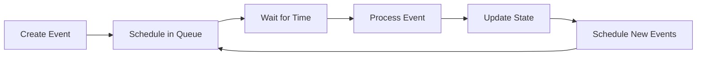

# Event Types

All event types in the Waremax simulation.

---

## Overview

Events drive the simulation forward. Each event type represents a specific occurrence.

---

## Order Events

### OrderArrival

A new order enters the system.

**Triggered by**: Poisson process (or other arrival distribution)

**Actions**:

- Create order with lines/items
- Assign due time (if configured)
- Trigger TaskAssignment

**Data**:

- Order ID
- Number of lines
- SKUs requested
- Due time (optional)

### OrderComplete

An order is fully fulfilled.

**Triggered by**: Last task for order completes

**Actions**:

- Mark order complete
- Calculate cycle time
- Update metrics

---

## Task Events

### TaskAssignment

A task is assigned to a robot.

**Triggered by**: OrderArrival, TaskComplete, RobotIdle

**Actions**:

- Select robot (via policy)
- Assign task to robot
- Schedule RobotDepart

**Data**:

- Task ID
- Robot ID
- Order ID
- Pickup location
- Delivery station

### TaskComplete

A task is completed.

**Triggered by**: ServiceEnd at station

**Actions**:

- Mark task complete
- Update order progress
- Free robot for next task

---

## Robot Events

### RobotDepart

A robot starts moving.

**Triggered by**: TaskAssignment, ServiceEnd

**Actions**:

- Calculate route
- Reserve path (if enabled)
- Schedule RobotArrive

**Data**:

- Robot ID
- Source node
- Destination node
- Route

### RobotArrive

A robot reaches a node.

**Triggered by**: Travel time elapsed

**Actions**:

- Update robot position
- Check if at destination
- If not: continue to next node
- If yes: join queue or start service

**Data**:

- Robot ID
- Node ID

### RobotWait

A robot begins waiting (traffic).

**Triggered by**: Path blocked by capacity

**Actions**:

- Record wait start
- Schedule retry or reroute

**Data**:

- Robot ID
- Blocked edge/node
- Wait reason

---

## Station Events

### QueueJoin

A robot joins a station queue.

**Triggered by**: RobotArrive at station

**Actions**:

- Add robot to queue
- Check if station has capacity
- If yes: schedule ServiceStart

**Data**:

- Robot ID
- Station ID

### ServiceStart

Service begins at a station.

**Triggered by**: QueueJoin (if capacity available) or ServiceEnd (next in queue)

**Actions**:

- Remove robot from queue
- Calculate service duration
- Schedule ServiceEnd

**Data**:

- Robot ID
- Station ID
- Service duration

### ServiceEnd

Service completes at a station.

**Triggered by**: Service duration elapsed

**Actions**:

- Free station capacity
- Complete task
- Schedule next robot service (if queue not empty)
- Schedule robot departure

---

## Charging Events

### ChargingStart

A robot begins charging.

**Triggered by**: Robot arrives at charger with low battery

**Actions**:

- Calculate charge time
- Schedule ChargingEnd

**Data**:

- Robot ID
- Charging station ID
- Initial SOC

### ChargingEnd

Charging completes.

**Triggered by**: Battery reaches target SOC

**Actions**:

- Update battery state
- Return robot to service
- Schedule TaskAssignment

---

## Maintenance Events

### MaintenanceDue

Scheduled maintenance is due.

**Triggered by**: Maintenance interval elapsed

**Actions**:

- Mark robot for maintenance
- Route to maintenance station

### MaintenanceStart

Maintenance begins.

**Triggered by**: Robot arrives at maintenance station

**Actions**:

- Calculate maintenance duration
- Schedule MaintenanceEnd

### MaintenanceEnd

Maintenance completes.

**Triggered by**: Maintenance duration elapsed

**Actions**:

- Return robot to service
- Reset maintenance timer

### FailureOccurred

Random failure occurs.

**Triggered by**: MTBF distribution

**Actions**:

- Stop robot
- Mark as failed
- Route to repair

### RepairComplete

Repair completes.

**Triggered by**: Repair duration elapsed

**Actions**:

- Return robot to service
- Resume normal operation

---

## Traffic Events

### DeadlockDetected

A deadlock is found.

**Triggered by**: Deadlock detection algorithm

**Actions**:

- Identify involved robots
- Apply resolution strategy

### ReservationExpired

A path reservation expires.

**Triggered by**: Reservation timeout

**Actions**:

- Release reserved segments
- Allow other robots to use

---

## System Events

### WarmupEnd

Warmup period ends.

**Triggered by**: warmup_minutes elapsed

**Actions**:

- Begin metrics collection
- Mark measurement period start

### SimulationEnd

Simulation terminates.

**Triggered by**: duration_minutes reached

**Actions**:

- Stop event processing
- Finalize metrics
- Generate report

### MetricsSample

Periodic metrics sampling.

**Triggered by**: sample_interval elapsed

**Actions**:

- Record current state
- Update time series data

---

## Event Lifecycle

---

## Related

- [Discrete Event Simulation](discrete-event.md) - How events are processed
- [Time Model](time-model.md) - Event timing
- [Determinism](determinism.md) - Reproducible event sequences
