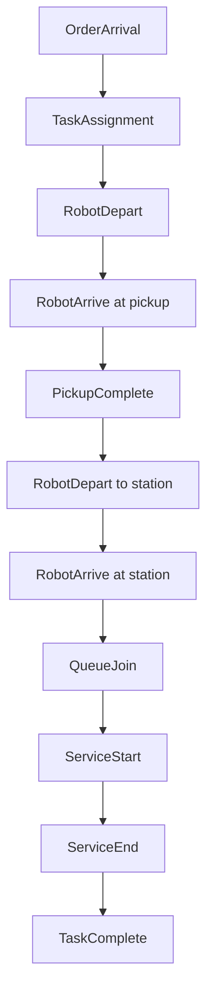

# Simulation Model

Understanding how Waremax simulates warehouse operations.

---

## Overview

Waremax uses **Discrete Event Simulation (DES)**, a modeling paradigm where the system state changes only at discrete points in time called events.

| Topic | Description |
|-------|-------------|
| [Discrete Event Simulation](discrete-event.md) | DES fundamentals |
| [Time Model](time-model.md) | How time advances |
| [Event Types](events.md) | Types of events |
| [Determinism & Seeds](determinism.md) | Reproducibility |

---

## Why Discrete Event Simulation?

### Compared to Time-Stepping

**Time-Stepping** (not used):

- Advances time in fixed increments (e.g., 1 second)
- Checks for changes every step
- Wastes computation when nothing happens

**Discrete Event Simulation** (used):

- Jumps directly to next meaningful event
- No wasted computation
- Efficient for sparse events

### Example

If a robot takes 30 seconds to travel:

| Approach | Steps |
|----------|-------|
| Time-stepping (1s) | 30 steps |
| DES | 2 events (depart, arrive) |

---

## Core Components

### Event Queue

A priority queue ordered by event time:

```
Event Queue:
  t=10.5s: RobotArrive(robot_0, node_5)
  t=12.3s: OrderArrival(order_42)
  t=15.0s: ServiceEnd(robot_2, station_1)
  ...
```

### Simulation Loop

```
while queue not empty and time < end_time:
    event = queue.pop_next()
    advance_time(event.time)
    process(event)
    # Processing may schedule new events
```

### State Updates

Events modify simulation state:

- Robot positions
- Queue contents
- Inventory levels
- Metrics counters

---

## Event Flow Example

Order fulfillment flow:



---

## Key Properties

### Determinism

Same seed + same configuration = identical results.

This enables:

- Reproducible experiments
- Fair comparisons
- Debugging

### Efficiency

- O(log n) event scheduling
- No idle computation
- Scales to complex scenarios

### Accuracy

- Events happen at exact times
- No time discretization error
- Realistic sequencing

---

## Next Steps

- [Discrete Event Simulation](discrete-event.md) - Deep dive into DES
- [Event Types](events.md) - All event types explained
- [Determinism](determinism.md) - Reproducibility details
