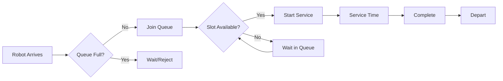

# Stations

Service points where robots are processed.

---

## Station Types

| Type | Purpose |
|------|---------|
| **Pick** | Order picking/fulfillment |
| **Drop** | Item delivery |
| **Inbound** | Receiving goods |
| **Outbound** | Shipping goods |
| **Charging** | Battery charging |
| **Maintenance** | Robot repair/maintenance |

---

## Station Model

### Components

```
Station
├── Location (node)
├── Concurrency (service slots)
├── Queue (waiting robots)
└── Service Time Model
```

### Service Flow



---

## Concurrency

Number of robots serviced simultaneously.

```yaml
stations:
  - id: "S1"
    concurrency: 3  # 3 robots at once
```

### Effective Capacity

```
Throughput ≈ concurrency × 3600 / avg_service_time
```

Example:

- Concurrency: 2
- Avg service: 10s
- Throughput: 720 tasks/hour max

---

## Queue

### Queue Capacity

```yaml
stations:
  - id: "S1"
    queue_capacity: 15
```

If not specified, queue is unlimited.

### Queue Behavior

When queue is full:

- Robot must wait elsewhere
- May reroute to another station

---

## Service Time

### Constant

Fixed time per service:

```yaml
service_time_s:
  distribution: constant
  base: 5.0
  per_item: 2.0
```

**Total** = base + (per_item × items)

### Lognormal

Variable, right-skewed:

```yaml
service_time_s:
  distribution: lognormal
  base: 8.0
  base_stddev: 2.0
  per_item: 2.0
  per_item_stddev: 0.5
```

Realistic for human operators.

### Exponential

Memoryless:

```yaml
service_time_s:
  distribution: exponential
  base: 10.0
```

For queuing theory models.

### Uniform

Even distribution:

```yaml
service_time_s:
  distribution: uniform
  min_s: 5.0
  max_s: 15.0
  per_item: 1.5
```

---

## Pick Stations

Most common station type.

### Function

- Receive picked items from robots
- Process for order fulfillment
- May involve human operators

### Configuration Example

```yaml
stations:
  - id: "pick_zone_a"
    node: "N100"
    type: pick
    concurrency: 2
    queue_capacity: 10
    service_time_s:
      distribution: lognormal
      base: 6.0
      base_stddev: 1.5
      per_item: 2.0
      per_item_stddev: 0.5
```

---

## Charging Stations

### Function

- Recharge robot batteries
- Return robots to service

### Properties

| Property | Description |
|----------|-------------|
| `bays` | Concurrent charging slots |
| `charge_rate_w` | Power per bay |
| `queue_capacity` | Waiting capacity |

### Charge Time

```
time = (capacity × (1 - soc)) / charge_rate
```

---

## Maintenance Stations

### Function

- Scheduled maintenance
- Failure repair
- Return robots to service

### Properties

| Property | Description |
|----------|-------------|
| `bays` | Concurrent service slots |
| `maintenance_duration_s` | Scheduled maintenance time |
| `repair_time` | Variable repair duration |

---

## Station Assignment

Policies determine which station handles each task:

| Policy | Behavior |
|--------|----------|
| `least_queue` | Shortest queue |
| `fastest_service` | Soonest completion |
| `due_time_priority` | Based on order urgency |

---

## Performance Metrics

### Utilization

```
utilization = busy_time / (total_time × concurrency)
```

### Average Queue

```
avg_queue = total_wait_time / observation_time
```

### Throughput

```
throughput = tasks_completed / measurement_time
```

---

## Related

- [Station Configuration](../../configuration/stations.md)
- [Station Assignment Policy](../policies/station-assignment.md)
