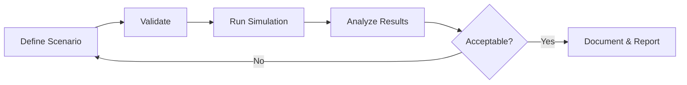

# User Guide

This guide covers the core concepts and workflows for using Waremax effectively.

---

## Overview

The User Guide is organized into the following sections:

| Section | Description |
|---------|-------------|
| [Running Simulations](running-simulations.md) | Detailed guide to executing simulations |
| [Scenario Files](scenario-files.md) | Understanding scenario configuration structure |
| [Map Configuration](map-configuration.md) | Creating warehouse topology maps |
| [Storage Configuration](storage-configuration.md) | Setting up racks and inventory |
| [Working with Presets](presets.md) | Using and customizing built-in presets |
| [Export Formats](export-formats.md) | Understanding output files and formats |

---

## Core Workflow

A typical Waremax workflow follows these steps:



### 1. Define Scenario

Create a YAML configuration file describing your warehouse:

- Map topology (nodes, edges)
- Robot fleet configuration
- Station definitions
- Order generation parameters
- Dispatching policies

### 2. Validate

Check your scenario for errors before running:

```bash
waremax validate --scenario my_scenario.yaml
```

### 3. Run Simulation

Execute the simulation:

```bash
waremax run --scenario my_scenario.yaml --output-dir ./results
```

### 4. Analyze Results

Review metrics, identify bottlenecks, and understand performance:

```bash
waremax analyze --scenario my_scenario.yaml
```

### 5. Iterate

Adjust parameters and re-run until you achieve desired results.

---

## Key Concepts

### Scenarios

A **scenario** is the complete configuration for a simulation, including:

- Simulation parameters (duration, warmup, seed)
- Physical layout (map, storage)
- Resources (robots, stations)
- Workload (order patterns)
- Behavior (policies)

### Presets

**Presets** are predefined scenario configurations for common use cases:

- `minimal` - Quick unit tests
- `standard` - General testing
- `stress_test` - High-load scenarios
- `battery_test` - Battery/charging focused
- `maintenance_test` - Reliability testing

### Policies

**Policies** control how the simulation makes decisions:

- **Task Allocation** - Which robot gets which task
- **Station Assignment** - Which station to use
- **Batching** - How to group items
- **Priority** - How to prioritize different task types

---

## File Organization

Recommended project structure for simulation projects:

```
my_project/
├── scenarios/
│   ├── baseline.yaml
│   ├── variant_a.yaml
│   └── variant_b.yaml
├── maps/
│   ├── warehouse_small.json
│   └── warehouse_large.json
├── storage/
│   └── inventory.yaml
├── results/
│   ├── baseline/
│   ├── variant_a/
│   └── variant_b/
└── analysis/
    └── comparison_report.md
```

---

## Common Tasks

### Compare Two Configurations

```bash
waremax compare --baseline baseline.yaml --variant variant.yaml --replications 5
```

### Run Parameter Sweep

```bash
waremax sweep --base baseline.yaml --sweep "robots:5,10,15,20" --output-dir ./sweep
```

### Statistical A/B Testing

```bash
waremax ab-test --baseline baseline.yaml --variant variant.yaml --replications 10 --alpha 0.05
```

### Performance Benchmarking

```bash
waremax benchmark --replications 5 --history ./benchmark_history.json
```

---

## Best Practices

### Reproducibility

- Always specify a `seed` in your scenario
- Document any manual changes
- Version control your scenario files

### Testing Changes

1. Start with a baseline configuration
2. Change one parameter at a time
3. Run multiple replications (different seeds)
4. Use statistical comparison tools

### Performance

- Use release builds for actual simulations
- Start with shorter durations for iteration
- Increase duration for final results
- Include adequate warmup period

### Documentation

- Add comments to scenario files
- Document the purpose of each configuration
- Record results and conclusions

---

## Next Steps

- **[Running Simulations](running-simulations.md)** - Deep dive into run options
- **[Scenario Files](scenario-files.md)** - Understand configuration structure
- **[Configuration Reference](../configuration/index.md)** - Complete parameter reference
